# Laboratorio 00

## Introducción a Verilog, simulación y máquinas de estados finitos (FSM)

---

## Integrantes

- Julián David Saavedra Pacheco — jusaavedrap@unal.edu.co
- Juan Sebastián Cortés Gutiérrez — jcortesgu@unal.edu.co
- Carlos Eduardo Matheus Quintero — cmatheus@unal.edu.co

**Grupo de trabajo:** #3 de los miércoles  
**Semestre:** 2026-2

---

## Índice

- [Diseño implementado](#diseño-implementado)
- [Simulaciones](#simulaciones)
- [Implementación](#implementación)
- [Conclusiones](#conclusiones)
- [Referencias](#referencias)

---

## Diseño implementado

En el laboratorio se desarrollaron dos sistemas obligatorios y un ejercicio adicional:

1. Una FSM para controlar las luces y los tiempos de un semáforo.
2. Una FSM con datapath para realizar acumulaciones durante varios ciclos.
3. Una ASM de control y datapath para transmitir serialmente un byte de ocho bits.

Las máquinas de estados finitos (FSM) describen los estados de un sistema y las condiciones que determinan sus transiciones. Las cartas de máquina de estados algorítmica (ASM) complementan esa descripción al organizar las decisiones y las operaciones sobre los datos dentro de cada estado. No son mecanismos independientes que deban conectarse entre sí: son formas relacionadas de representar el control secuencial y su coordinación con el datapath.

### Ejercicio 1: FSM de control para un semáforo

El módulo [`stoplight`](src/stoplight.v) implementa un semáforo vehicular mediante una FSM. Se utilizaron cuatro estados para representar por separado los dos intervalos en los que se enciende la luz amarilla:

| Estado | Salida activa | Duración | Función |
|---|---|---:|---|
| `S0` | `green` | 5 ciclos | Permitir el paso. |
| `S1` | `yellow` | 2 ciclos | Advertir el cambio de verde a rojo. |
| `S2` | `red` | 4 ciclos | Detener el paso. |
| `S3` | `yellow` | 2 ciclos | Advertir el cambio de rojo a verde. |

La secuencia de operación es `S0 → S1 → S2 → S3 → S0`. Solo una de las salidas `green`, `yellow` o `red` puede permanecer activa en cada instante.

El controlador podría haberse planteado inicialmente con tres estados, uno por cada color. Sin embargo, en este diseño se incorporó `S3` para representar de manera explícita el intervalo amarillo que ocurre después del rojo. Aunque `S1` y `S3` activan la misma salida `yellow`, corresponden a situaciones lógicas diferentes: `S1` indica que el sistema viene de verde y debe continuar hacia rojo, mientras que `S3` indica que viene de rojo y debe regresar a verde. De esta manera, el propio estado conserva la información sobre la etapa anterior y determina sin ambigüedad el siguiente estado. Esta separación evita utilizar una bandera adicional de dirección y permite expresar la lógica de transición de forma directa, legible y sencilla de implementar en HDL.

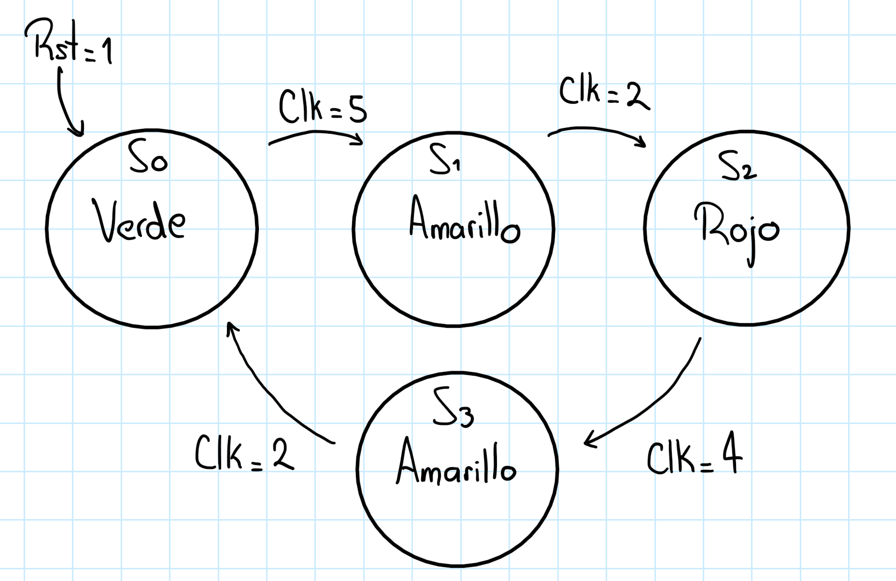

#### Tabla de transición de estados

Con `rst = 0`, la lógica combinacional determina `next_state` según la tabla y el registro de estado se actualiza en el siguiente flanco positivo del reloj. El reset asíncrono tiene prioridad: al activarse, establece `state = S0` y `counter = 0`.

| Estado actual | Condición | Estado siguiente |
|---|---|---|
| `S0` | `counter != 3'd4` | `S0` |
| `S0` | `counter == 3'd4` | `S1` |
| `S1` | `counter != 3'd1` | `S1` |
| `S1` | `counter == 3'd1` | `S2` |
| `S2` | `counter != 3'd3` | `S2` |
| `S2` | `counter == 3'd3` | `S3` |
| `S3` | `counter != 3'd1` | `S3` |
| `S3` | `counter == 3'd1` | `S0` |
| Caso `default` | Estado no reconocido por el `case` | `S0` |

El contador se incrementa mientras se permanece en un estado y se reinicia al cambiar de estado. Las condiciones usan `!=`, en correspondencia con las ramas `else` del HDL. Como el conteo empieza en cero, los valores terminales 4, 1, 3 y 1 corresponden a duraciones de 5, 2, 4 y 2 ciclos, respectivamente. Las etiquetas `Clk` del diagrama indican esas duraciones en ciclos, no el valor lógico de la señal `clk`.

#### Tabla de salidas por estado

| Estado actual | `green` | `yellow` | `red` |
|---|---|---|---|
| `S0` | 1 | 0 | 0 |
| `S1` | 0 | 1 | 0 |
| `S2` | 0 | 0 | 1 |
| `S3` | 0 | 1 | 0 |

Las luces dependen únicamente del estado actual. La salida adicional `counter[2:0]` expone el registro de temporización y cambia durante la permanencia en cada estado.

### Ejercicio 2: FSM con datapath para un acumulador

El módulo [`accumulator`](src/accumulator.v), denominado `Contador` en su primera versión, implementa un acumulador secuencial. La FSM controla el momento en que se inicializa y actualiza el registro `acc[5:0]`, mientras que el datapath realiza las sumas y lleva el conteo de las operaciones.

Los estados definidos son:

| Estado | Operación principal |
|---|---|
| `IDLE` | Esperar el pulso `start`. |
| `LOAD` | Inicializar `acc` y el contador interno; esperar un `num_suma` distinto de cero. |
| `ADD` | Sumar `num_suma` y evaluar el criterio de terminación. |
| `DONE` | Activar `done` durante un ciclo y regresar a `IDLE`. |

La entrada `num_veces[1:0]` tiene cuatro códigos que seleccionan tres comportamientos; `00` y `11` son equivalentes:

| `num_veces` | Operación |
|---:|---|
| `2'b00` | Sumar hasta que el siguiente valor de `acc` sea mayor o igual que 20. |
| `2'b01` | Realizar 3 sumas. |
| `2'b10` | Realizar 4 sumas. |
| `2'b11` | Sumar hasta que el siguiente valor de `acc` sea mayor o igual que 20, igual que `00`. |

La señal `cancel` reinicia la operación en curso. La FSM regresa a `LOAD`, limpia el acumulador y el contador, y comienza nuevamente con los valores de entrada presentes.

Si `num_suma = 0`, el circuito permanece en `LOAD`, con los registros en cero y `done = 0`. Al recibir un sumando distinto de cero continúa a `ADD`, sin necesitar otro pulso `start`. Si el sumando cambia a cero durante `ADD`, vuelve a `LOAD` y reinicia la operación desde cero cuando se recibe un valor válido. Las entradas `num_suma` y `num_veces` se consultan durante la operación; salvo esa prueba de espera, se mantienen estables para completar cada cálculo con una configuración definida.

Con una configuración estable, los modos de cantidad fija realizan como máximo cuatro sumas de 15, cuyo resultado es 60 y cabe en `acc[5:0]`. En los modos por umbral, el resultado final no supera 34. El contador interno tiene cinco bits para representar hasta las veinte sumas necesarias cuando `num_suma = 1`.

#### Diagrama de transición de estados

El diagrama incluye la equivalencia de los modos `00` y `11`, la espera en `LOAD` cuando el sumando es cero y el retorno desde `ADD` por cancelación o sumando cero. En las expresiones del dibujo, `+` representa OR lógico y el punto representa AND lógico. La transición `ADD → LOAD` tiene prioridad sobre la permanencia en `ADD` y la finalización; estas últimas se consideran únicamente cuando `cancel = 0` y `Cero = 0`, como detalla la tabla de transición.

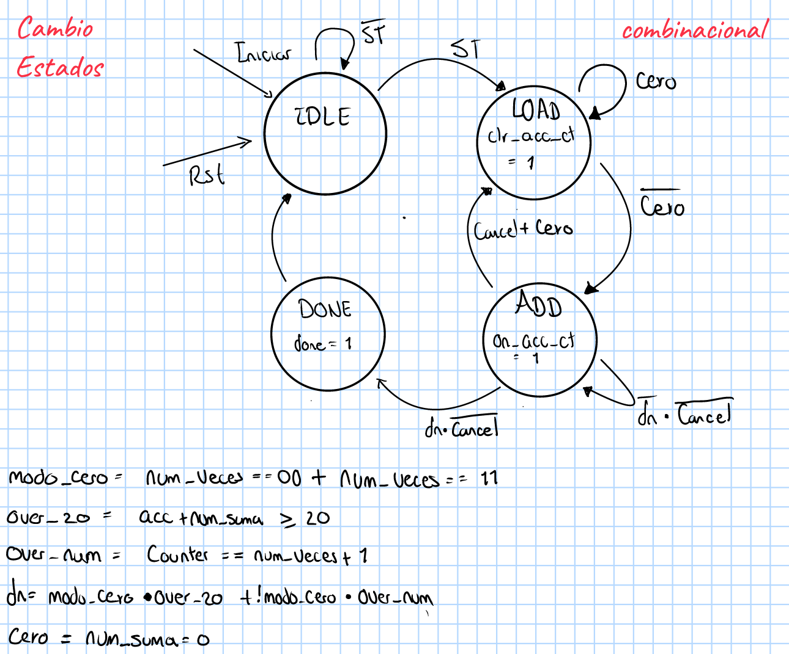

#### Diagrama del datapath

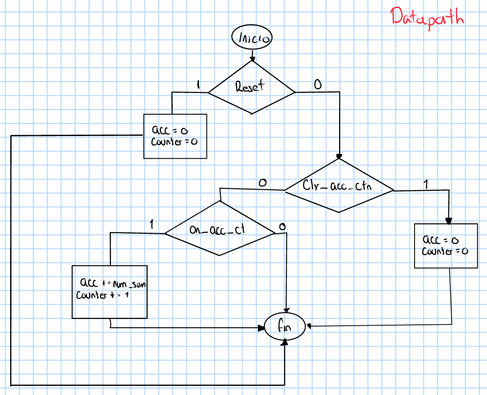

Las etiquetas de borrado y habilitación de suma representan conceptualmente las acciones de `LOAD` y `ADD`. El HDL implementa esas acciones directamente mediante un `case (state)`, sin señales separadas con esos nombres.

#### Tabla de transición de estados

Las condiciones siguientes se evalúan con `reset = 0` y utilizan los valores actuales de los registros. El reset asíncrono tiene prioridad sobre la operación normal y establece `state = IDLE`, `acc = 0` y `counter = 0`.

| Estado actual | Condición | Estado siguiente |
|---|---|---|
| `IDLE` | `start == 0` | `IDLE` |
| `IDLE` | `start == 1` | `LOAD` |
| `LOAD` | `num_suma == 0` | `LOAD` |
| `LOAD` | `num_suma != 0` | `ADD` |
| `ADD` | `cancel == 1`, independientemente del criterio de finalización | `LOAD` |
| `ADD` | `cancel == 0` y `num_suma == 0` | `LOAD` |
| `ADD` | `cancel == 0`, `num_suma != 0`, modo `00` o `11` y `acc + num_suma >= 20` | `DONE` |
| `ADD` | `cancel == 0`, `num_suma != 0`, modo `00` o `11` y `acc + num_suma < 20` | `ADD` |
| `ADD` | `cancel == 0`, `num_suma != 0`, modo `01` o `10` y `counter == num_veces + 1` | `DONE` |
| `ADD` | `cancel == 0`, `num_suma != 0`, modo `01` o `10` y `counter != num_veces + 1` | `ADD` |
| `DONE` | Incondicional | `IDLE` |
| Caso `default` | Estado no reconocido por el `case` | `IDLE` |

Dentro de `ADD`, `cancel` tiene prioridad sobre ambas condiciones de finalización; fuera de ese estado no interviene en las transiciones. `start` solo se consulta en `IDLE`.

#### Ajuste de las condiciones del diagrama al HDL

En el planteamiento inicial se utilizaban `counter == num_veces + 2` y `acc >= 20` para representar la cantidad total de sumas y el umbral de finalización. Al implementar el circuito fue necesario anticipar esas comparaciones, porque el registro de estado y el datapath se actualizan en el mismo flanco positivo mediante asignaciones no bloqueantes (`<=`). Ambos bloques evalúan sus expresiones con los valores anteriores al flanco, y las actualizaciones se aplican posteriormente. Así, aunque en ese flanco el estado pase de `ADD` a `DONE`, el datapath todavía ejecuta la suma correspondiente al estado anterior, `ADD`.

Por esta razón, en los modos `01` y `10` el HDL compara `counter == num_veces + 1`: al cumplirse la condición, se realiza la última suma y el contador alcanza `num_veces + 2`. Por ejemplo, con `num_veces = 1`, se decide finalizar cuando el contador vale 2 y la tercera suma se registra al entrar en `DONE`. En los modos `00` y `11`, la condición `acc + num_suma >= 20` anticipa el valor que tendrá el acumulador después de la última suma. Con `num_suma = 6`, la decisión se toma cuando `acc = 18` y el resultado final es 24; con `num_suma = 5`, se finaliza exactamente en 20.

El ajuste evita una suma adicional. Se debe a la semántica normal de los registros síncronos y las asignaciones no bloqueantes, no a un orden accidental de ejecución entre los bloques. La lógica de siguiente estado es combinacional (`always @(*)`); no se ejecuta únicamente en el flanco del reloj. La comparación de umbral es **mayor o igual que 20**, no estrictamente mayor. La tabla anterior incorpora las condiciones actuales y la prioridad de `cancel`.

#### Tabla de salidas y operaciones por estado

| Estado actual | `done` | Actualización de `acc` en el próximo flanco | Actualización de `counter` en el próximo flanco |
|---|---|---|---|
| `IDLE` | 0 | Conserva su valor | Conserva su valor |
| `LOAD` | 0 | `acc <= 0` | `counter <= 0` |
| `ADD` | 0 | `acc <= acc + num_suma` | `counter <= counter + 1` |
| `DONE` | 1 | Conserva el resultado | Conserva el conteo |

`done` es una salida combinacional del estado, mientras que `acc` es una salida registrada del datapath. Las actualizaciones indicadas se realizan con el reset inactivo y según el estado anterior al flanco. Por ello, incluso cuando `cancel` provoca la transición `ADD → LOAD`, se efectúa una última suma en ese flanco; el borrado ocurre en el siguiente, al salir de `LOAD`. `DONE` dura un ciclo y, por tanto, también el pulso `done`.

### Ejercicio 3: transmisor serial mediante ASM (Bono)

El módulo [`control_bytetx`](src/control_bytetx.v) transmite un byte de manera serial, comenzando por el bit menos significativo. La unidad de control coordina un registro de desplazamiento, un contador de bits y un contador de temporización.

El parámetro `CLKS_PER_BIT` se configuró en 4, por lo que a cada bit se le asignan cuatro ciclos de reloj. Si dos o más bits consecutivos tienen el mismo valor, `tx` mantiene ese nivel durante varios intervalos de bit; no tiene que cambiar en cada límite. Este módulo envía los ocho bits de datos sin añadir bits de inicio, parada o paridad, por lo que no constituye por sí solo un transmisor UART completo.

| Estado | Operación principal |
|---|---|
| `S_IDLE` | Mantener `tx = 1` y esperar un pulso `start`. |
| `S_LOAD` | Cargar `data_in` en `shift_reg` e inicializar los contadores. |
| `S_BIT_HOLD` | Transmitir `shift_reg[0]`, contar los ciclos y desplazar el registro. |
| `S_DONE` | Activar `done` durante un ciclo y regresar a reposo. |

La operación de desplazamiento se realiza dentro de `S_BIT_HOLD` al terminar el tiempo asignado a cada uno de los primeros siete bits. Al completar el octavo, se pasa a `S_DONE` sin otro desplazamiento.

#### Diagrama ASM del transmisor

El diagrama reúne la secuencia de control y las operaciones del datapath: carga del byte, temporización de cada bit, desplazamiento y finalización. El conector 1 indica el retorno desde `DONE` a `IDLE`.

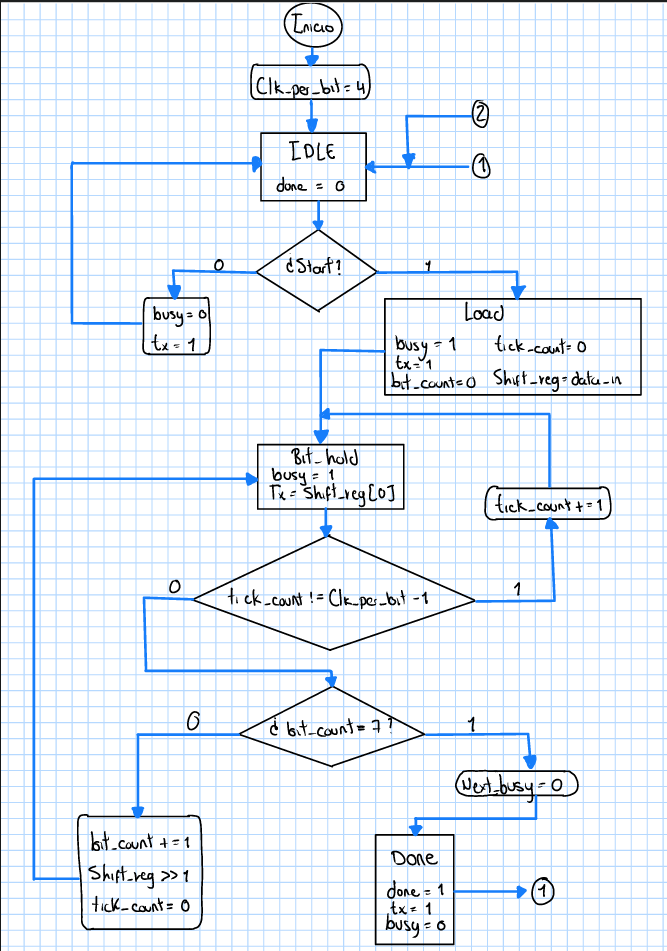

#### Reset asíncrono

El reset puede interrumpir la transmisión desde cualquier estado. Pone en cero `busy` y los registros del datapath, y el conector 2 lleva el control a `IDLE` en el diagrama principal.

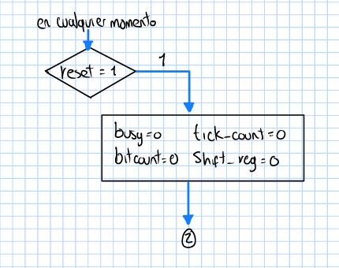

#### Tabla de transición de estados

Con `rst = 0`, las transiciones se registran en los flancos positivos del reloj. El reset asíncrono establece `state = S_IDLE`, `busy = 0` y pone en cero `shift_reg`, `bit_count` y `tick_cnt`.

| Estado actual | Condición | Estado siguiente | Acción del datapath en el próximo flanco |
|---|---|---|---|
| `S_IDLE` | `start == 0` | `S_IDLE` | Conserva los registros |
| `S_IDLE` | `start == 1` | `S_LOAD` | Conserva los registros |
| `S_LOAD` | Incondicional | `S_BIT_HOLD` | Carga `data_in` en `shift_reg`; reinicia ambos contadores |
| `S_BIT_HOLD` | `tick_cnt != CLKS_PER_BIT - 1` | `S_BIT_HOLD` | Incrementa `tick_cnt` |
| `S_BIT_HOLD` | `tick_cnt == CLKS_PER_BIT - 1` y `bit_count != 7` | `S_BIT_HOLD` | Reinicia `tick_cnt`, desplaza `shift_reg` a la derecha insertando un cero e incrementa `bit_count` |
| `S_BIT_HOLD` | `tick_cnt == CLKS_PER_BIT - 1` y `bit_count == 7` | `S_DONE` | Conserva los registros |
| `S_DONE` | Incondicional | `S_IDLE` | Conserva los registros |
| Caso `default` | Estado no reconocido por el `case` | `S_IDLE` | Conserva los registros |

Primero se comprueba si terminó la duración del bit; solo entonces se evalúa si corresponde al último bit. `bit_count` identifica el bit actual con valores de 0 a 7. La señal `start` solo se atiende en `S_IDLE` y el byte se captura al salir de `S_LOAD`.

#### Tabla de salidas por estado

| Estado actual | `tx` | `done` | `busy` |
|---|---|---|---|
| `S_IDLE` | 1 | 0 | 0 |
| `S_LOAD` | 1 | 0 | 1 |
| `S_BIT_HOLD` | `shift_reg[0]` | 0 | 1 |
| `S_DONE` | 1 | 1 | 0 |

`tx` y `done` se calculan en el bloque combinacional. `busy` es una salida registrada con un único controlador: se inicializa en cero durante el reset y se actualiza mediante `busy <= next_busy` en cada flanco positivo. La lógica combinacional prepara `next_busy = 1` cuando se acepta `start`, lo mantiene durante la carga y el envío, y prepara `next_busy = 0` cuando termina el octavo bit. De esta forma, `busy` se activa al entrar en `S_LOAD` y se desactiva al entrar en `S_DONE`, simultáneamente con la activación de `done`. El pulso `done` dura un ciclo. Si se activa `rst` durante un envío, `busy` se desactiva de forma asíncrona y la transmisión se aborta.

---

## Simulaciones

Los tres diseños se compilaron con Icarus Verilog. Los testbenches generan un archivo VCD que permite observar las señales internas y externas en GTKWave.

Los tres testbenches incluyen comprobaciones automáticas: una discrepancia detiene la simulación con `$fatal`, y cada ejecución satisfactoria termina con un mensaje `PASS`. También incluyen un tiempo máximo para detectar bloqueos. La señal `test_id` identifica en el VCD la prueba en curso. Los estímulos normales y la desactivación del reset se aplican en flancos negativos; las comprobaciones se realizan después de que las actualizaciones del flanco positivo hayan finalizado. Las pruebas asíncronas activan el reset entre flancos y verifican su efecto antes del siguiente flanco positivo.

### Simulación del semáforo

El testbench [`tb_stoplight`](src/tb_stoplight.v) genera un reloj de periodo `10 ns`. Primero verifica dos secuencias completas sin interrupciones y comprueba, ciclo a ciclo, el estado, el contador y las tres luces. Después aplica un reset asíncrono desde cada uno de los cuatro estados (`S0`, `S1`, `S2` y `S3`) y verifica el retorno inmediato a verde con el contador en cero. Finalmente comprueba otra secuencia completa. La señal `reset_mask` termina en `4'b1111`, indicando que se probaron los cuatro estados de origen.

| `test_id` | Comprobación |
|---|---|
| 0 | Reset inicial |
| 1 | Dos secuencias completas con duraciones de 5, 2, 4 y 2 ciclos |
| 2, 3, 4, 5 | Reset desde `S0`, `S1`, `S2` y `S3`, respectivamente |
| 6 | Secuencia completa después de los resets |

Las formas de onda permiten verificar que:

- las tres luces son mutuamente excluyentes;
- el reset establece `state = S0` y `counter = 0`;
- la luz verde permanece activa durante 5 ciclos;
- cada intervalo amarillo dura 2 ciclos;
- la luz roja permanece activa durante 4 ciclos;
- la secuencia se repite automáticamente.

#### Evidencia

Vista general de la simulación de 0 a 720 ns. Se observan las dos secuencias iniciales, los resets de las pruebas 2 a 5 y la recuperación en la prueba 6. Los estados se muestran en binario: `00` corresponde a verde, `01` al primer amarillo, `10` a rojo y `11` al segundo amarillo.

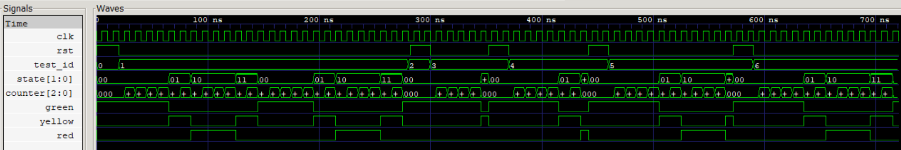

#### Detalle de la secuencia de luces

Después del reset inicial, el contador recorre los valores de cada intervalo y se reinicia al cambiar de estado. Se distinguen las duraciones de cinco ciclos en verde, dos en amarillo, cuatro en rojo y dos en el segundo amarillo. Los estados y el contador se muestran en binario.

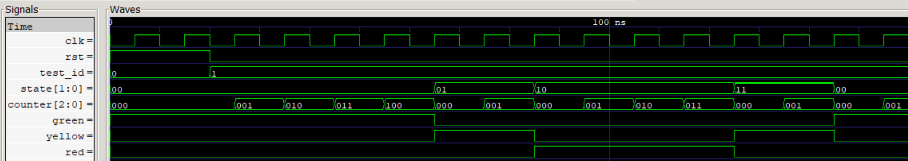

#### Reset durante el estado rojo

En la prueba 4, `rst` se activa mientras `state = 10` y la luz roja está encendida. El estado vuelve a `00`, el contador se borra y se enciende verde sin esperar al siguiente flanco positivo. Mientras el reset permanece activo, el contador se mantiene en cero.

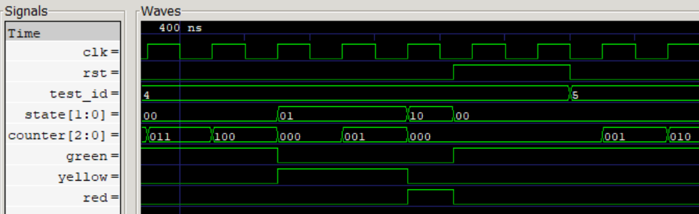

### Simulación del acumulador

El testbench [`tb_accumulator`](src/tb_accumulator.v) genera un reloj de periodo `10 ns` y ejecuta quince pruebas. Verifica las sumas parciales, el contador, los estados, el resultado final, la espera en `LOAD` y la duración de un ciclo de `done`:

| Prueba | Configuración | Resultado observado |
|---:|---|---:|
| 1 | `num_suma = 5`, tres sumas | `acc = 15` |
| 2 | `num_suma = 5`, cuatro sumas | `acc = 20` |
| 3 | Modo `11`, `num_suma = 4`, hasta alcanzar 20, con cancelación | La operación se reinicia y finaliza con `acc = 20`. |
| 4 | `num_suma = 6`, hasta `acc >= 20` | Secuencia `0, 6, 12, 18, 24`; resultado `acc = 24`. |
| 5 | `num_suma = 5`, hasta `acc >= 20` | Finaliza exactamente con `acc = 20`; verifica el caso de igualdad. |
| 6 | Tres sumas de 5; `cancel` coincide con la condición de finalización | Se prioriza `LOAD` sobre `DONE`, se reinicia la operación y finaliza con `acc = 15`. |
| 7 | Modo `11`, `num_suma = 6` | Cuatro sumas y resultado 24, igual que en la prueba 4 con modo `00`. |
| 8 | Modo `01`, `num_suma = 15` | Tres sumas y resultado 45. |
| 9 | Modo `10`, `num_suma = 15` | Cuatro sumas y resultado 60, sin desbordamiento. |
| 10–13 | Modos `00`, `01`, `10` y `11`, respectivamente; sumando cero y luego 5 | Espera en `LOAD` y arranque sin otro `start`; resultados 20, 15, 20 y 20. |
| 14 | Modo `00`; el sumando cambia de 6 a 0 durante `ADD` y luego vuelve a 6 | Retorno a `LOAD`, borrado y reinicio; resultado 24. |
| 15 | Modo `11`, `num_suma = 1` | Veinte sumas y resultado 20; contador final igual a 20. |

En todas las pruebas, `done` permanece activo durante un solo ciclo. Durante la tercera prueba, el acumulador alcanza 12, regresa a cero por la operación de `LOAD` y reinicia la suma. La sexta prueba demuestra específicamente la prioridad de `cancel` cuando también se cumple el criterio de terminación. `test_id` coincide con el número de prueba de la tabla.

#### Evidencia

La vista general muestra las quince pruebas de la simulación actual, que termina en 1950 ns, y el contador interno de cinco bits. En estas capturas, `num_suma`, `acc` y `counter` se muestran en hexadecimal; `state` y `num_veces`, en binario. Por ejemplo, `0F`, `14`, `18` y `3C` representan 15, 20, 24 y 60 en decimal.

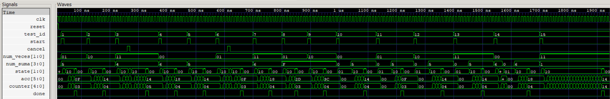

#### Tres y cuatro sumas

Las pruebas 1 y 2 usan `num_suma = 5`. El modo `01` termina tras tres sumas, con `acc = 0F` (15), y el modo `10` termina tras cuatro, con `acc = 14` (20). La última suma coincide con la entrada en `DONE` (`state = 11`) y con el pulso de `done`.

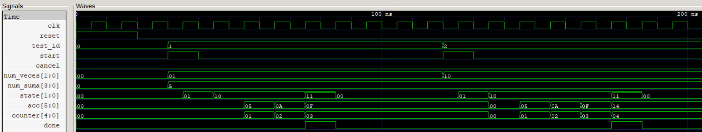

#### Prioridad de cancelación

En la prueba 6, `cancel` se activa cuando la siguiente suma completaría la operación. El controlador entra en `LOAD` (`01`) en lugar de `DONE`: todavía se registra la suma de ese flanco, pero `done` permanece desactivado. En el siguiente flanco se borran los registros y comienza de nuevo la secuencia, que finalmente entrega 15.

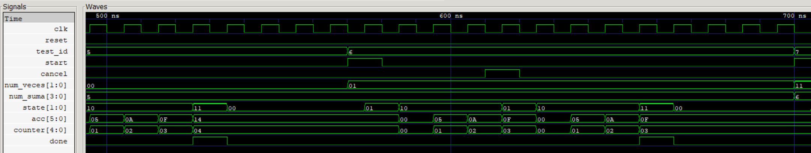

#### Equivalencia de los modos por umbral

La prueba 4 utiliza el modo `00` y la prueba 7 el modo `11`, ambas con sumando 6. En los dos casos se observa la secuencia hexadecimal `00, 06, 0C, 12, 18`, equivalente a `0, 6, 12, 18, 24`, y la finalización después de cuatro sumas. Esto muestra que `11` ya no selecciona una cantidad fija de cinco sumas.

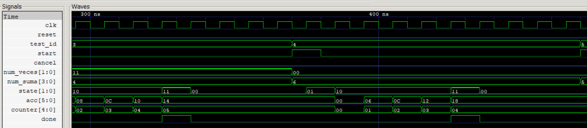

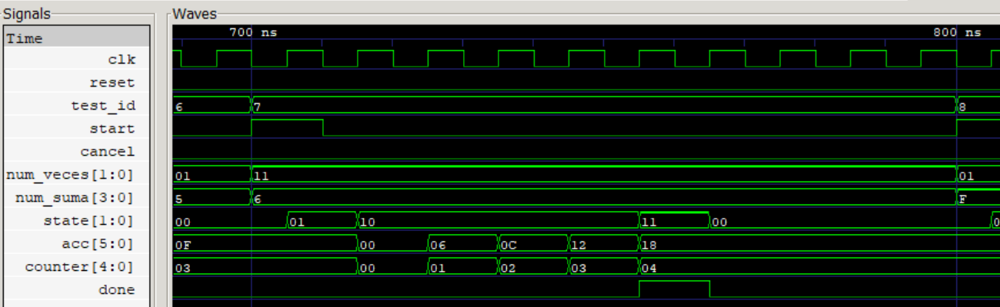

#### Espera en LOAD con sumando cero

En la prueba 10, el pulso `start` lleva a `LOAD`, pero el controlador permanece allí mientras `num_suma = 0`. Tras el borrado, `acc` y `counter` se mantienen en cero. Cuando el sumando cambia a 5, se pasa a `ADD` sin otro pulso `start` y se finaliza en 20. La misma captura muestra previamente el resultado 60 (`3C`) de la prueba 9.

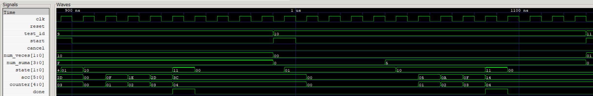

#### Retorno a LOAD durante una operación

En la prueba 14, el sumando cambia de 6 a cero después de la primera suma. El estado vuelve a `LOAD` sin activar `done`; los registros se borran en el siguiente flanco. Al restablecer el sumando en 6, el cálculo reinicia desde cero y termina en 24 (`18` hexadecimal).

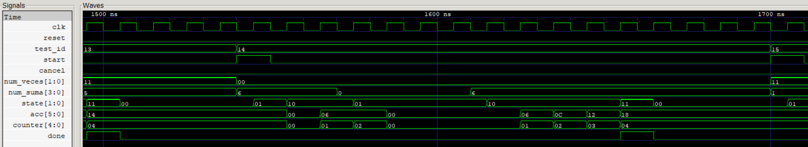

#### Veinte sumas de uno

La prueba 15 utiliza el modo `11` con sumando 1. El acumulador y el contador avanzan juntos hasta `14` hexadecimal, equivalente a 20. El contador de cinco bits representa todas las sumas sin volver a cero antes de terminar.

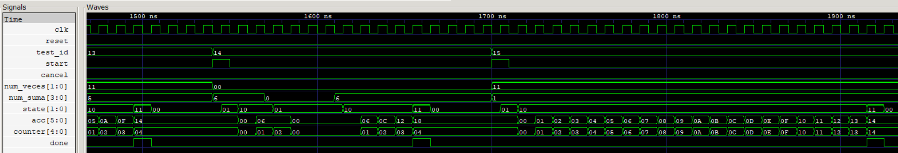

### Simulación del transmisor serial

El testbench [`tb_bytetx`](src/tb_bytetx.v) genera pulsos `start` de un ciclo y verifica cada ciclo de cada bit, incluso cuando dos bits consecutivos tienen el mismo valor. Comprueba `tx`, `state`, `shift_reg`, `bit_count`, `tick_cnt`, `busy` y `done`, además de reconstruir el byte en `recibido`. El parámetro `CLKS_PER_BIT = 4` se pasa explícitamente al módulo simulado.

| Prueba | Byte solicitado | Representación binaria (MSB a LSB) | Resultado |
|---:|---:|---|---|
| 1 | `8'hA5` | `1010_0101` | Correcto |
| 2 | `8'hF0` | `1111_0000` | Correcto |
| 3 | `8'h01` | `0000_0001` | Correcto |
| 4 | `8'h96` | `1001_0110` | Envío abortado intencionalmente por reset; `busy = 0`, `done = 0` y `tx = 1`. |
| 5 | `8'h3C` | `0011_1100` | Correcto después del reset |

La simulación finaliza con cero errores y confirma que:

- se transmiten los ocho bits en orden LSB-first;
- cada bit dura exactamente 4 ciclos de reloj, equivalentes a `40 ns`;
- `busy` permanece activo durante la carga y la transmisión, y baja al entrar en `S_DONE`;
- `done` se activa durante un único ciclo al finalizar cada byte;
- `shift_reg`, `bit_count` y `tick_cnt` evolucionan de acuerdo con la transmisión.

Las pruebas 1, 2, 3 y 5 completan el envío y comprueban que `done` dura exactamente un ciclo y coincide con `busy = 0`. La prueba 4 verifica la respuesta asíncrona al reset durante un envío. `test_id` coincide con el número de prueba de la tabla.

#### Evidencia

Vista general de las cinco pruebas, de 0 a 1620 ns. Los envíos completos reconstruyen `A5`, `F0`, `01` y `3C` en `recibido`. En cada finalización, `busy` baja al mismo tiempo que se activa `done`. La prueba 4 interrumpe el envío de `96` mediante reset: `busy` baja sin generar un pulso de finalización y la prueba 5 muestra la recuperación. Los bytes se muestran en hexadecimal; `state` y `tick_cnt`, en binario.

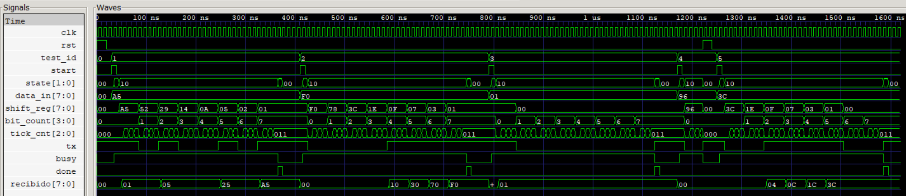

#### Transmisión del byte A5

La prueba 1 muestra la carga de `A5` y el desplazamiento de `shift_reg` hacia la derecha. `bit_count` recorre los índices de 0 a 7 y `tick_cnt` cuenta de `000` a `011` para cada bit, asignándole cuatro ciclos. La salida transmite primero el bit menos significativo y `recibido` reconstruye el valor `A5`.

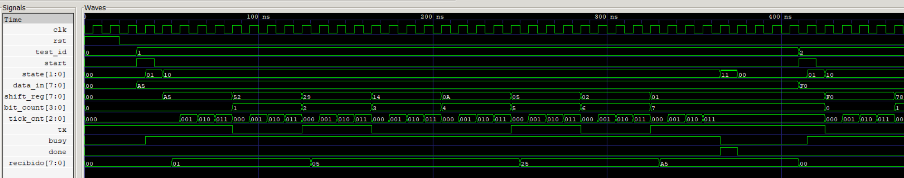

#### Finalización y desactivación de busy

Al terminar el último bit, en el flanco de 365 ns, el estado pasa a `DONE` (`11`), `busy` baja y `done` sube. En el siguiente flanco, a 375 ns, se regresa a `IDLE` (`00`) y `done` baja. La línea `tx` permanece en uno, que coincide tanto con el último bit de `A5` como con el nivel de reposo.

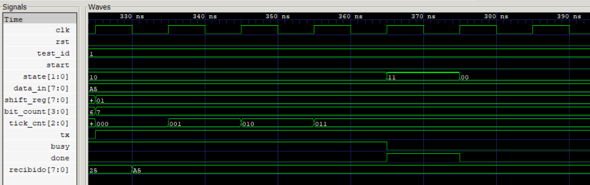

#### Reset durante la transmisión y recuperación

La prueba 4 inicia el envío de `96` y lo interrumpe mediante reset. Se observa el retorno inmediato a `IDLE`, el borrado de los registros, `busy = 0` y `tx = 1`, sin pulso de `done`. Después, la prueba 5 carga `3C` y comienza una nueva transmisión.

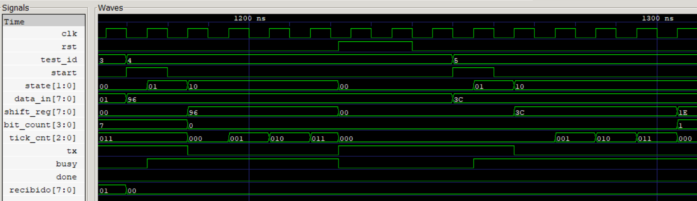

---

## Implementación

El código fuente y los testbenches se encuentran en la carpeta `src/`:

```text
.
├── README.md
└── src/
    ├── stoplight.v
    ├── tb_stoplight.v
    ├── tb_stoplight.vvp
    ├── stoplight.vcd
    ├── accumulator.v
    ├── tb_accumulator.v
    ├── tb_accumulator.vvp
    ├── accumulator.vcd
    ├── control_bytetx.v
    ├── tb_bytetx.v
    ├── tb_bytetx.vvp
    ├── bytetx.vcd
    └── img/
        ├── stoplight.png
        ├── stoplight_sequence.png
        ├── stoplight_reset.png
        ├── stoplight_state_diagram.png
        ├── accumulator.png
        ├── accumulator_fixed_sums.png
        ├── accumulator_cancel.png
        ├── accumulator_mode_00.png
        ├── accumulator_mode_11.png
        ├── accumulator_load_wait.png
        ├── accumulator_zero_restart.png
        ├── accumulator_twenty_sums.png
        ├── accumulator_state_diagram.png
        ├── accumulator_datapath_diagram.png
        ├── accumulator_control_datapath_diagram.png
        ├── bytetx.png
        ├── bytetx_a5.png
        ├── bytetx_done.png
        ├── bytetx_reset.png
        ├── bytetx_asm_diagram.png
        └── bytetx_reset_diagram.png
```

Cada diseño separa el registro de estado de la lógica combinacional encargada de calcular las transiciones. Durante la operación normal, los registros del datapath se actualizan en los flancos positivos del reloj; el reset asíncrono puede reiniciarlos sin esperar ese flanco. Las señales `next_*` representan valores calculados por lógica combinacional y no registros adicionales de almacenamiento.

- En `stoplight.v`, `state` almacena el estado presente y `counter` controla la duración de cada luz. El reset es asíncrono y lleva el sistema al estado verde.
- En `accumulator.v`, la FSM genera la secuencia `IDLE → LOAD → ADD → DONE`. El registro `acc` y el contador de operaciones forman el datapath. El reset es asíncrono.
- En `control_bytetx.v`, `shift_reg` almacena el byte, `tick_cnt` controla la duración de cada bit y `bit_count` registra el avance de la transmisión. La salida se realiza LSB-first.

---

## Conclusiones

- El uso de máquinas de estados finitos y de su representación mediante cartas ASM permite describir de forma ordenada sistemas cuyo comportamiento depende de una secuencia de decisiones y operaciones. En electrónica digital, esta organización facilita dividir un problema complejo en estados, condiciones de transición y acciones concretas. El mismo enfoque puede aplicarse al control de procesos, la automatización y los protocolos de comunicación.
- La separación entre la unidad de control y el datapath permitió distinguir cuándo debe ejecutarse una operación de cómo se realiza. En el acumulador, la FSM coordina el borrado y las sumas; en el transmisor, coordina la carga, el desplazamiento y la duración de cada bit. Esta separación facilita comprender el diseño y localizar errores sin mezclar las decisiones de control con el procesamiento de los datos.
- El semáforo mostró que un estado no representa solamente una salida, sino también información necesaria para decidir el comportamiento futuro. Aunque `S1` y `S3` encienden la misma luz amarilla, distinguirlos permite determinar si la siguiente luz debe ser roja o verde, sin una bandera adicional de dirección.
- La implementación del acumulador evidenció la importancia de analizar qué valores se leen y cuáles se actualizan en cada flanco de reloj. Las condiciones anticipadas de finalización permiten incluir la última suma sin ejecutar una operación adicional. Asimismo, definir la prioridad de `cancel` evita ambigüedades cuando una cancelación coincide con el criterio de terminación.
- El transmisor permitió relacionar el conteo de ciclos con la duración de los bits y comprobar la coordinación entre `busy` y `done`. Mantener un único bloque secuencial encargado de `busy`, con su siguiente valor calculado de forma combinacional, hace explícitos tanto el comienzo como el final de la transmisión y la respuesta al reset.
- Las comprobaciones automáticas y las formas de onda se complementaron: los testbenches verificaron resultados y tiempos concretos, mientras que GTKWave permitió observar la relación entre estados, registros y salidas. Los resultados respaldan el funcionamiento en los escenarios ensayados, pero también muestran la importancia de documentar los límites de los registros y ampliar las pruebas a casos extremos antes de generalizar el diseño o implementarlo físicamente.

---

## Referencias

- J. Velásquez, [*Lab00: Introducción a Verilog, Simulación y Máquinas de Estados Finitos (FSM)*](https://github.com/jovelasquezs/2026-2_Lab_Electronica_Digital_2_G3yG4/tree/c399f7cf5ea67687f09072e6198d7571c03dd918/labs/lab00), material de Electrónica Digital II, 2026-2.
